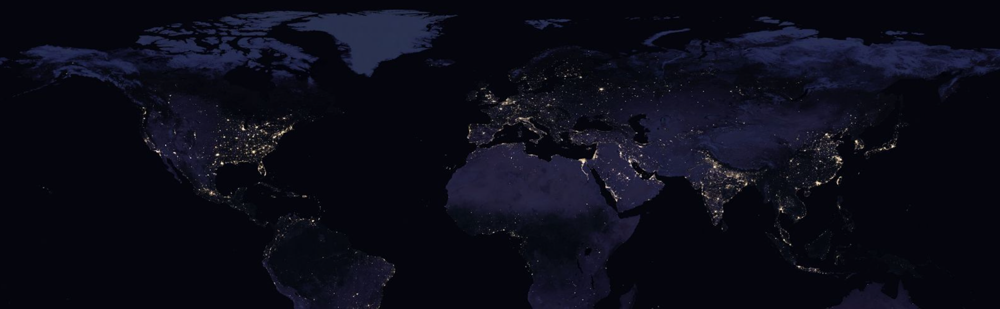

.. Geo-Python documentation master file, created by
   sphinx-quickstart on Thu Aug 23 14:00:02 2018.
   You can adapt this file completely to your liking, but it should at least
   contain the root `toctree` directive.

Welcome to COMP 590 Data Science for Earth, Spring 2020!
========================================================

This course will introduce the tools of data science and machine learning for analysing the earth and its natural and human systems. 

Course format
-------------

This course will have two concurrent goals:  1)  introduce students to the tools of data science and basic machine learning (identifying and processing data, cleaning and preparing data for analysis, setting up problems including supervised/unsupervised learning, regression, and classification, optimization and hyperparameter analysis, and specific techniques such as random forest, gradient boosting and neural networks. And  2) introduce students to the analysis of geospatial data sets, with an introduction to satellite data products (Landsat, Sentinel, GOES, etc.), compute platforms such as Google Earth Engine and Microsoft Azure, and data frameworks such as Xarray and pandas. We will use scientific python (Jupyter Notebooks mainly) and introduce students to these tools at a basic level.

Schedule
--------

We will meet every Monday from 1:25-4:25 in Carolina Hall 220

.. list-table:: ''
   :widths: 5 10
   :header-rows: 1

   * - Week
     - Topics
   * - 1/13
     - Course Introductions:
         * Intro to data science
         * Intro to geospatial data
         * Form groups by interest area
   * - 1/27
     - Exploring data:
         * Pandas for tabular data, time-series
         * Matplotlib for plotting and visualization
         * Group presentations
   * - 2/3
     - Geospatial visualization:
         * Xarray
         * Cartopy
         * Google Earth Engine
         * Group presentations
   * - 2/10
     - Intro to machine learning:
         * Supervised learning: train/test concept
         * Classification and regression
         * Optimization, gradient descent
         * Scikit-learn
         * Group presentations
   * - 2/17
     - Machine learning:
         * Bias-variance tradeoff and over-fitting
         * Regularization
         * Example: logistic regression
         * Scikit-learn
         * Group presentations
   * - 2/24
     - Machine learning alorithms I:
         * Random forest
         * Feature importance
         * Group presentations
   * - 3/2
     - Machine learning algoriths II:
         * XGBoost
         * Group presentations
   * - 3/16
     - Intro to neural networks:
         * Convolutional neural nets
         * Imagenet, Res-nets
         * Group presentations
   * - 3/23
     - Neural nets continued:
         * Deep learning
         * Group presentations
   * - 3/30
     - Unsupervised learning:
         * Generative Adversarial Networks (GANs)
         * Group presentations
   * - 4/6
     - GANs continued:
         * CycleGAN
         * BigGAN
         * Group presentations
   * - 4/13
     - TBA:
         * Group presentations
   * - 4/20
     - TBA:
         * Peer review papers
   * - 4/30
     - Final group presentations

   

.. toctree::
    :maxdepth: 2
    :caption: Course information

    course-info/course-info
    course-info/grading
    
