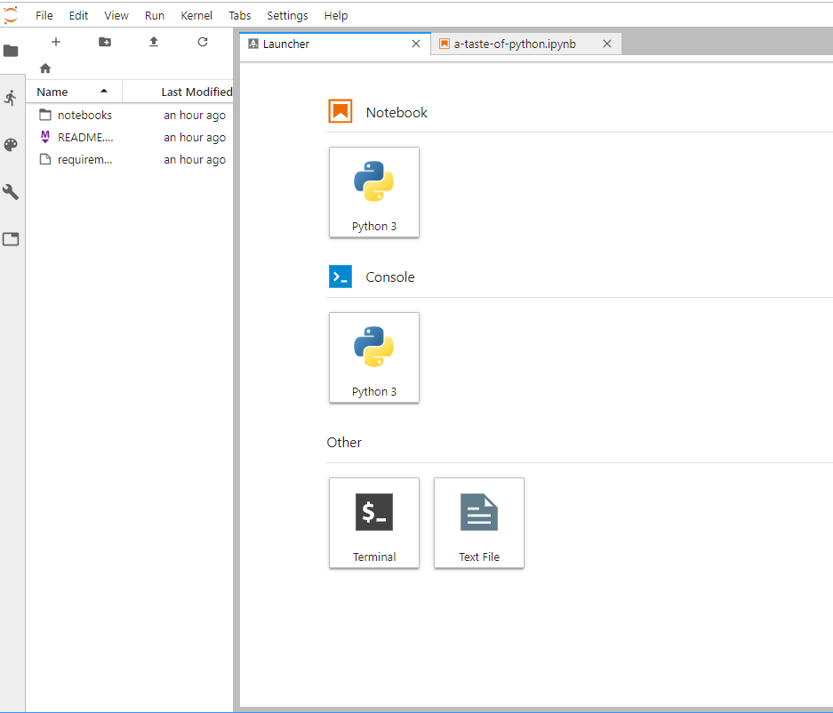

Course environment
==================

During this course, we will use different tools and applications for programming and communications:

1. `JupyterLab`_ in a cloud computing environment, specifically the `ocean.pangeo.io <https://ocean.pangeo.io>`_ binderhub. This is a Jupyter hub provided by the open-source geoscience project `Pangeo <https://pangeo.io>`_. Pangeo operates two Jupyter hubs, `ocean.pangeo.io <https://ocean.pangeo.io>`_ and `hydro.pangeo.io <https://hydro.pangeo.io>`_. For this class, let's use ocean, but hydro can be a backup. 

2. `Git and GitHub`_ for version control and documentation

3. `Slack`_ for communicating among course participants

JupyterLab
------------
`JupyerLab <https://jupyterlab.readthedocs.io/en/stable/getting_started/overview.html>`__ is an open-source web-based user interface for doing data science.
The Jupyter lab interface consists of different components such as a file browser, terminal, image viewer, console, text editor, etc.

**Jupyter Notebooks** (filename extension ``.ipynb``) are documents inside the JupyterLab environment which contain computer code, and rich text elements (figures, links etc.).
Jupyter Notebooks are perfect for documenting a data science workflow in an interactive format.

We use JupyterLab/Jupyter Notebooks as the default programming environment during this course. All of the course materials are available in a JupyterLab setting via `cloud computing environments`_ (the Pangeo binderhub).

   Basic view of JupyterLab

.. figure:: img/JupyterLab.png
   :alt: A Jupyter Notebook open in Jupyter Lab
   :width: 700px

   A Jupyter Notebook open in Jupyter Lab

Cloud computing environments
--------------------------------

We will use cloud-based computing environments (Pangeo, Google Colaboratory, Microsoft Azure) to access interactive online version of the lessons
and to work on the weekly exercises. You can use the cloud computing environments with any computer as long as it has a reasonably fast internet connection and a web browser.

Please note that the cloud computing environments are **temporary**. Always remember to push your changes to GitHub (and / or download a local copy).

Each interactive lecture and assignment will have a link for Pangeo and a launch button for opening a notebook in Google Colaboratory.

Using your own computer
--------------------------------
We recommend everyone to use the available `cloud computing environments`_ during this course.
In case you want to work on your own computer, start by `installing Python (via Anaconda) <https://geo-python.github.io/site/course-info/installing-anacondas.html>`_.

Git and GitHub
---------------

One of the core goals of this course (besides learning programming)
is to learn how to use `version control <https://en.wikipedia.org/wiki/Version_control>`__ with
`Git <https://en.wikipedia.org/wiki/Git_(software)>`__ and storing your
codes (privately) on `GitHub <https://github.com/>`__.

`Git <https://en.wikipedia.org/wiki/Git_(software)>`__ is a version
control software used to track and store
changes in your files (often source code for programs) without losing
the history of past changes. Files in Git are stored in a repository,
which you can simply think of as a directory containing files (or other
directories) related to a single 'project'. Git is widely used by
professionals to keep track of what they’ve done and to collaborate with
other people.

`GitHub <https://github.com/>`__ is a web based Git repository hosting
service and social network. It is the largest online storage space of
collaborative works that exists in the world. It is a place where you
can share your code openly to the entire world or alternatively only to
your collaborators working on the same project. GitHub provides a nice
web-interface to your files that is easy to use. It is a nice way for
exploring the codes and documentation or e.g., teaching materials such
as those in our course.

Both Git and GitHub provide many more features than the ones mentioned
here, but for now we are happy to understand the basic idea of what they
are.

Slack
------

During the course we will use actively an application called `Slack <http://slack.com>`__ for discussion and
questions about the lessons and exercises. All enrolled students have received an invite link to the `COMP590.800` workspace at the start of the course.
:doc:`Read more about Slack  <slack-usage>`.

Page summary
------------

Now you should have (at least) a basic idea about the different
components of our course environment and what they mean. You don't need
to understand everything fully at this point as they will become clearer
when we start using the course environment.